# Help Desk Lab

A help desk simulation built on the same Active Directory domain as my [V1 SOC lab](../V1-SOC-lab). I worked through 8 common support tickets the way I would on the job: confirm the problem, find the actual cause, fix it, and verify the fix from the user's side. I also ran into two real problems in the lab along the way and wrote those up as bonus tickets.

## Environment

| Machine | Role | IP |
|---|---|---|
| DC01 | Windows Server 2022 domain controller for corp.lab (AD DS, DNS, file shares) | 10.0.0.1 |
| WIN01 | Windows 11 domain-joined client | 10.0.0.2 |

Both VMs run in VirtualBox on an isolated internal network. I did most account work in Active Directory Users and Computers (ADUC), since that's what help desk uses day to day, and used PowerShell to verify results.

Before starting, I set up an OU structure that separates active users, disabled accounts, and groups. This also gives Group Policy a clean place to target.

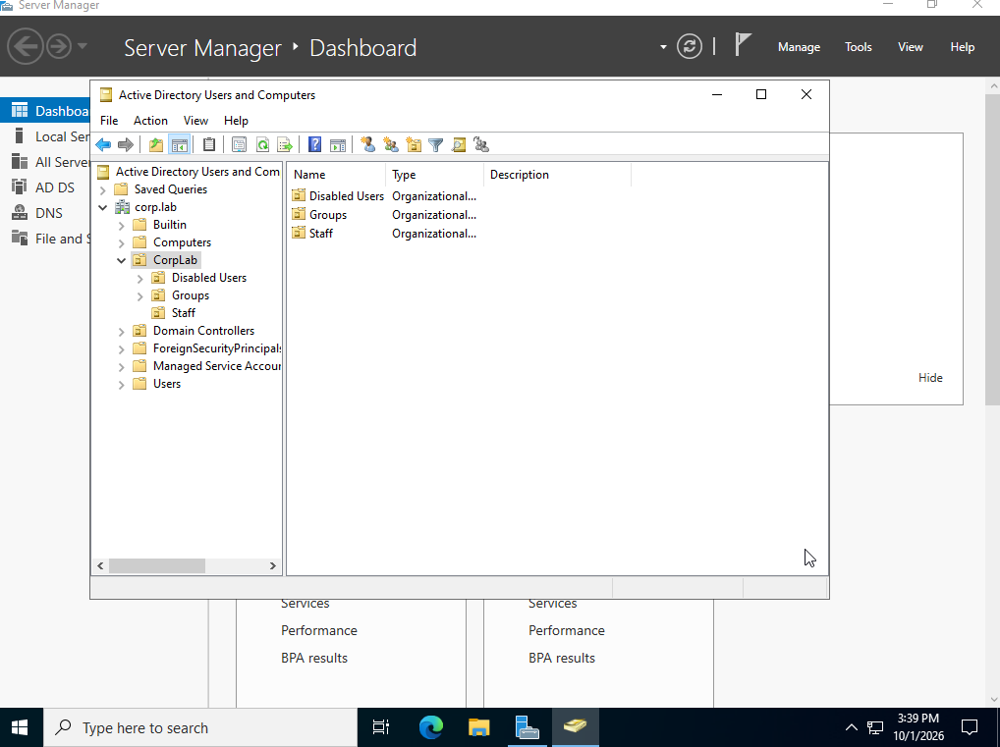

Test accounts: **Jordan Rivera (jrivera)**, a Marketing Coordinator, and **Morgan Lee (mlee)**, an employee being offboarded. All passwords used are throwaway test passwords.

## Tickets

| # | Ticket | Main tools |
|---|---|---|
| 1 | New employee onboarding | ADUC, whoami |
| 2 | Locked-out account | ADUC, Get-ADUser |
| 3 | Employee offboarding | ADUC, Get-ADUser |
| 4 | Access to a shared folder | Get-ADUser, security groups |
| 5 | Map a network drive | Group Policy Preferences |
| 6 | Can't reach network resources | ipconfig, ping, nslookup |
| 7 | Mapped drive disappeared | gpresult, gpupdate |
| 8 | Can open files but can't save | icacls, Get-SmbShareAccess |
| Bonus | Clock drift between client and DC | w32tm |
| Bonus | DC registering an unreachable IP in DNS | nslookup, Get-DnsClient |

---

### Ticket #1: New employee onboarding

**Request:** Jordan Rivera starts Monday as a Marketing Coordinator and needs a domain account with Marketing access.

**Resolution:** I created a Global Security group called Marketing, then created Jordan's account in the Staff OU with a temporary password and "User must change password at next logon" checked, so IT never knows the user's real password. I filled in his title and department and added him to the Marketing group.

**Verified:** I signed in to WIN01 as `corp\jrivera`, completed the forced password change, and confirmed the Marketing group was in his token with `whoami /groups`.

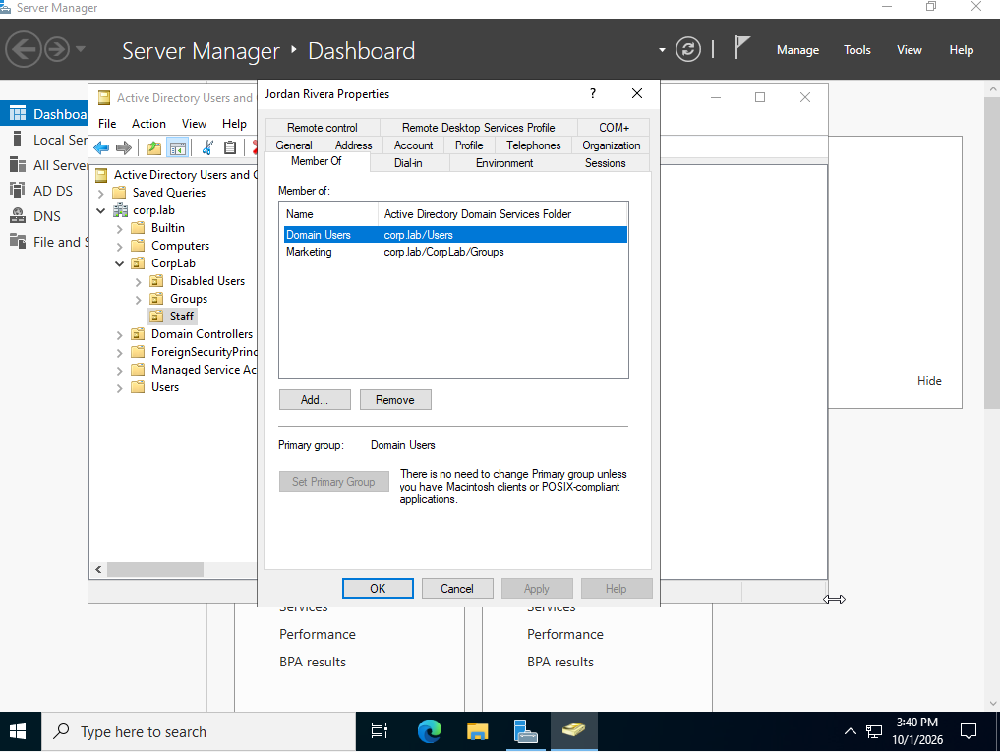
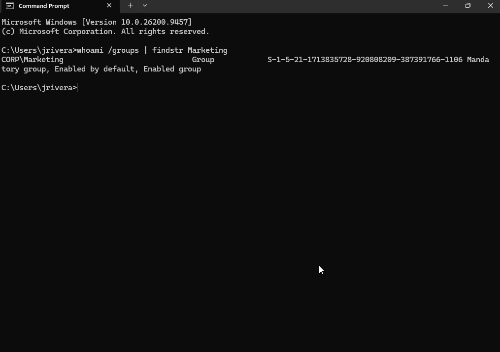

---

### Ticket #2: Locked-out account

**Issue:** Jordan can't sign in. WIN01 says his account is locked out.

**Diagnosis:** On DC01, `Get-ADUser` showed LockedOut as True with 5 bad logon attempts, which confirmed the account was locked by the lockout policy and not some other sign-in problem.

**Resolution:** I unlocked the account from the Account tab in ADUC, then reset his password to a temporary one with "User must change password at next logon" checked so he sets his own.

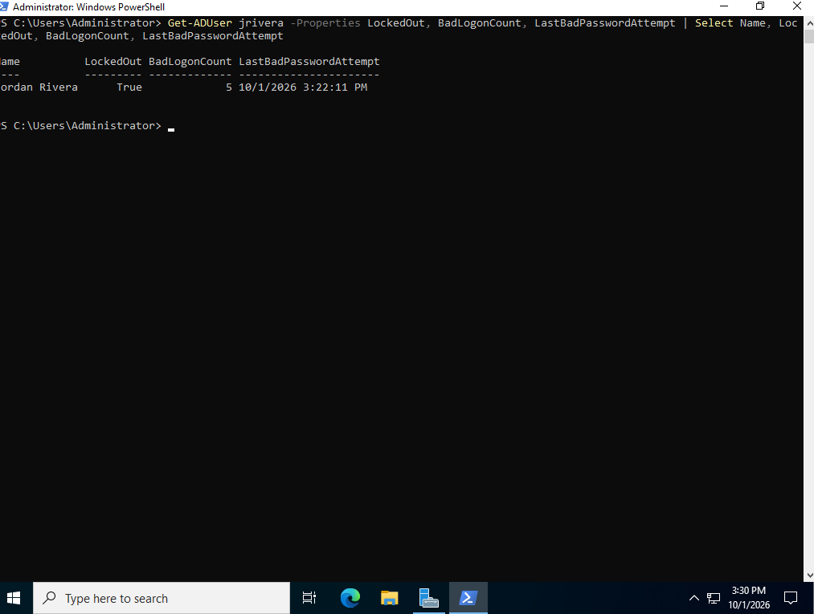
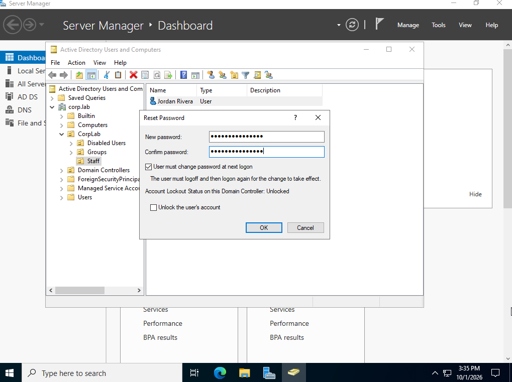

---

### Ticket #3: Employee offboarding

**Request:** Morgan Lee is leaving the company and their access needs to be removed.

**Resolution:** I added a description noting the offboarding date and their former group, disabled the account, reset the password, removed Morgan from Marketing, and moved the account to the Disabled Users OU. Disabling instead of deleting keeps the account available if files or access need to be recovered later.

**Verified:** `Get-ADUser` confirmed the account was disabled, in the Disabled Users OU, and had no group memberships. A sign-in attempt on WIN01 was refused.

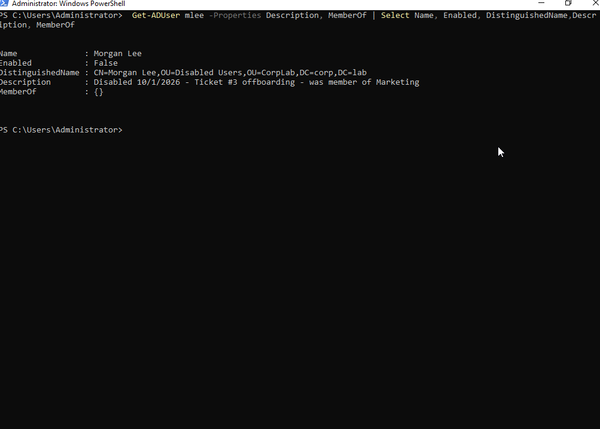
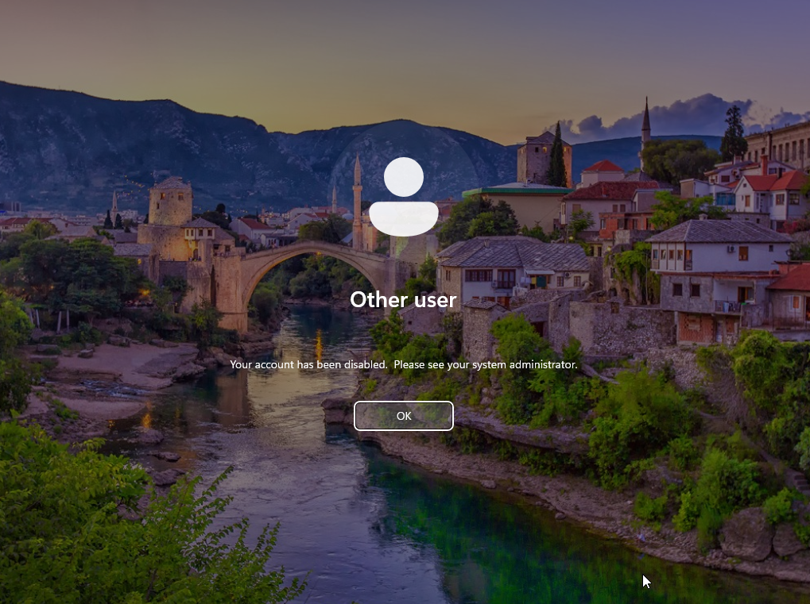

---

### Ticket #4: Access to the Sales shared folder

**Issue:** Jordan needs access to the Sales team's shared folder for a Q4 project and gets "Access Denied" when opening `\\DC01\Sales`.

**Diagnosis:** The share's NTFS permissions only allow the CORP\Sales group (plus Administrators and SYSTEM). `Get-ADUser jrivera -Properties MemberOf` showed Jordan was only in Marketing.

**Resolution:** I added Jordan to the Sales group instead of giving his account permissions on the folder directly, since managing access through groups keeps permissions clean and easy to audit. Group membership is only added to a user's access token at sign-in, so I had him sign out and back in. He could then open the share and its files.

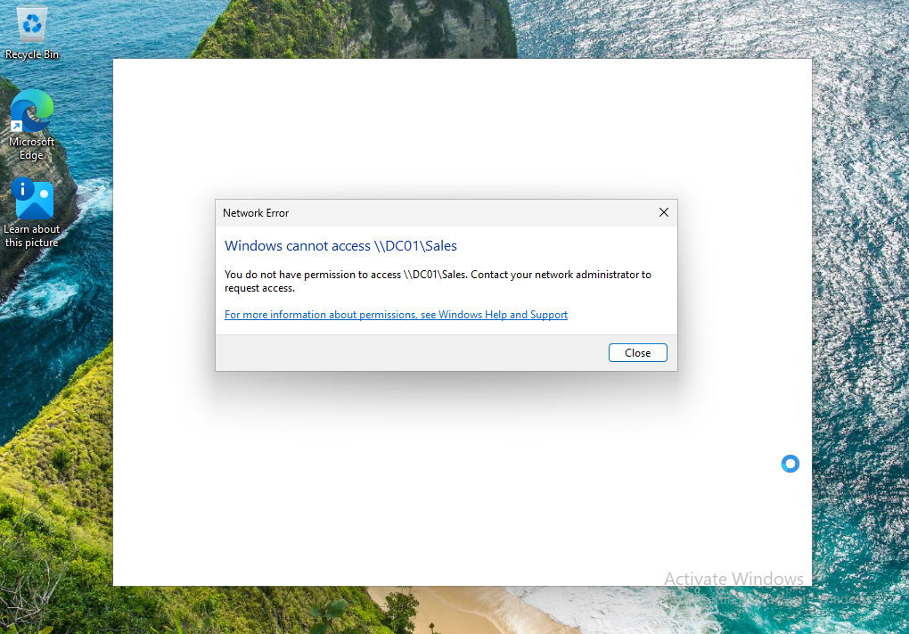
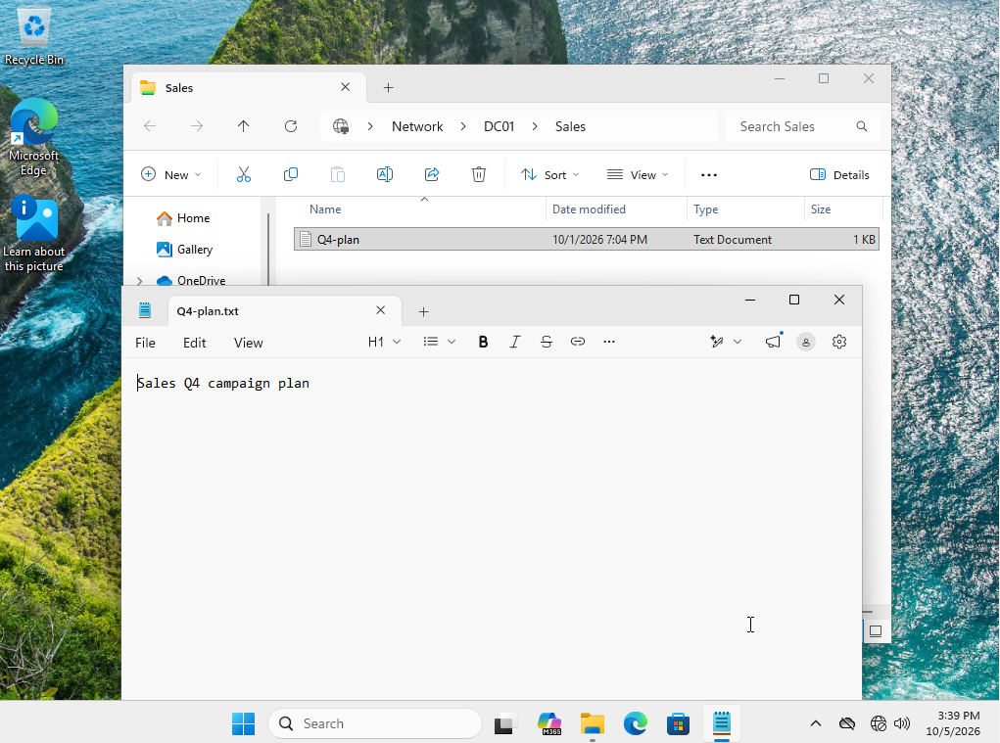

---

### Ticket #5: Map the Sales folder as a network drive

**Request:** Jordan wants the Sales folder to show up as a drive instead of typing the path every time.

**Resolution:** Mapping it by hand would only fix it for one user on one PC, so I used Group Policy instead. I created a GPO called "Map S Drive - Sales" linked to the Staff OU, with a Drive Maps preference mapping `S:` to `\\DC01\Sales`. I used item-level targeting so the drive only applies to members of the Sales group, not everyone in Staff.

**Verified:** After `gpupdate /force` and signing out and back in, the S: drive appeared on WIN01.

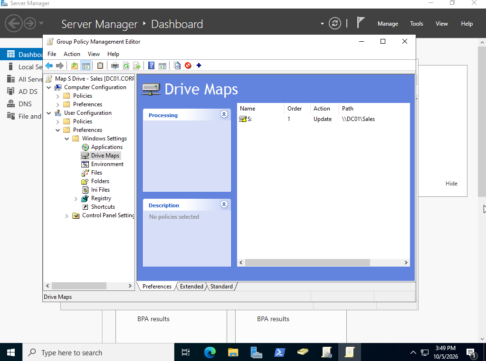
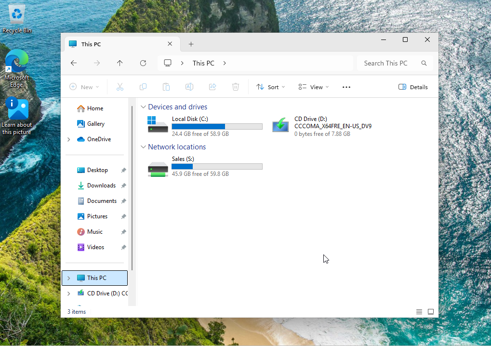

---

### Ticket #6: Can't reach network resources

**Issue:** A user on WIN01 can't open the Sales share or reach anything on the domain by name.

**Diagnosis:** `ping DC01.corp.lab` failed with "could not find host," but `ping 10.0.0.1` succeeded with no loss. The connection was fine and the problem was name resolution. `nslookup` showed queries going to 10.0.0.99, which isn't a DNS server. The PC's DNS setting had been changed from the domain controller to a bad address.

**Resolution:** I set the preferred DNS server back to 10.0.0.1 and ran `ipconfig /flushdns`. Name resolution and ping by name both worked again.

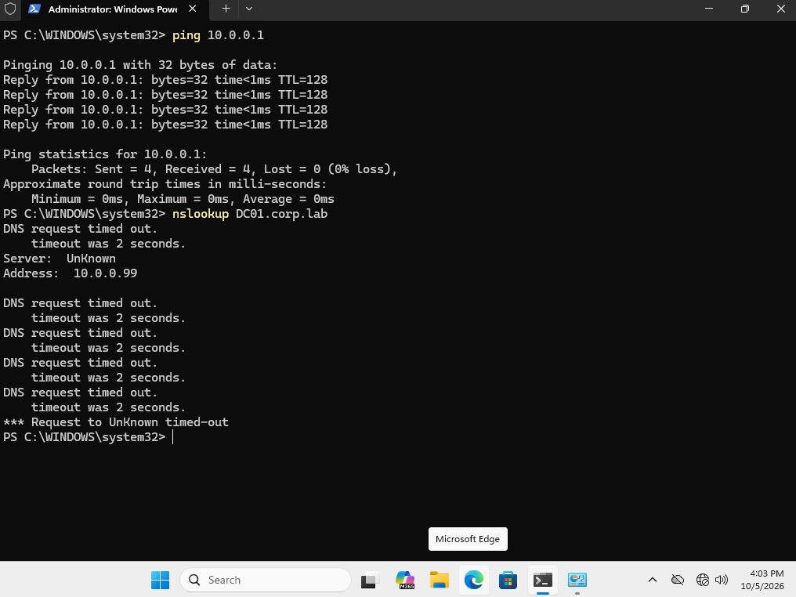
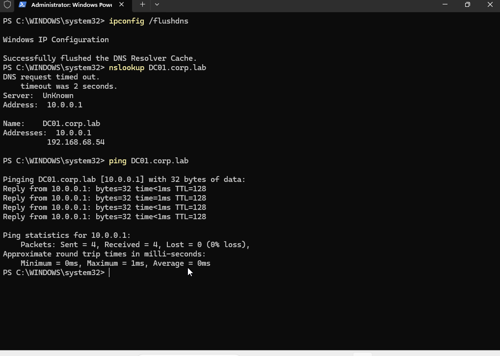

---

### Ticket #7: Mapped drive disappeared

**Issue:** Jordan's S: drive was gone after he signed in.

**Diagnosis:** `gpresult /r /scope user` showed no Group Policy Objects applied to him, even though he was still in the Sales group. His account was in the default Users container instead of the Staff OU. The drive map GPO is linked to Staff, so his account had been moved out of its scope.

**Resolution:** I moved Jordan back to the Staff OU and confirmed the location with `Get-ADUser`. After `gpupdate /force` and a sign-out, gpresult showed the GPO applied and the S: drive was back.

Two details from this one: GPOs apply to child OUs but not parent OUs, so placing the account in the parent CorpLab OU would not have fixed it. And the old drive didn't disappear on its own when the GPO stopped applying, because "Remove this item when it is no longer applied" wasn't enabled on the drive map.

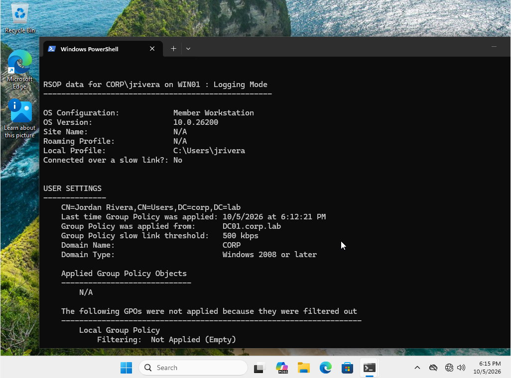
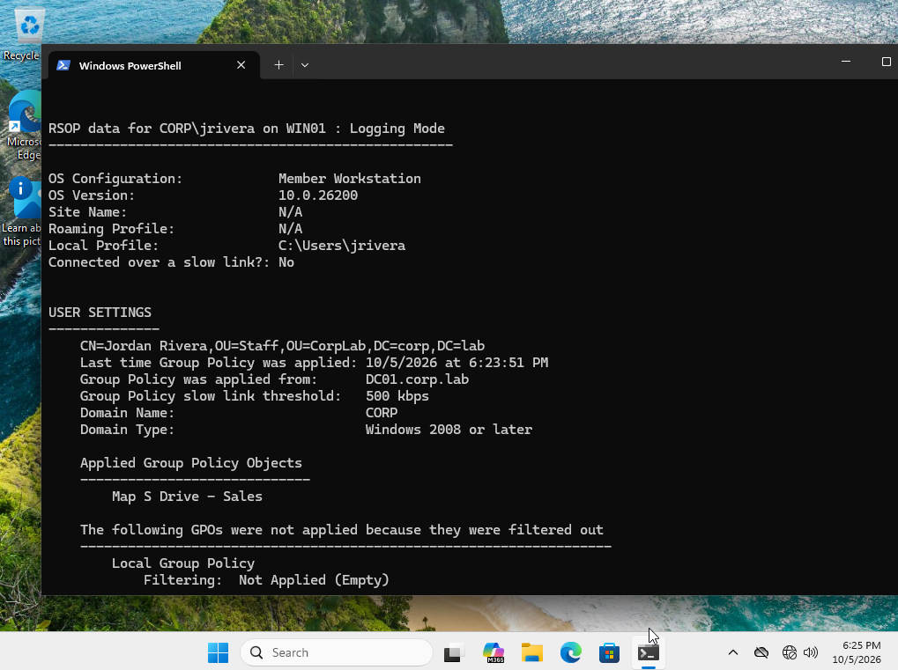

---

### Ticket #8: Can open files but can't save them

**Issue:** Jordan could open a file on the S: drive but got a permission error when saving.

**Diagnosis:** Shared folders have two permission layers: share permissions, applied when connecting over the network, and NTFS permissions, applied to the folder itself. The more restrictive one wins. `icacls` showed the Sales group had Modify on the folder, but `Get-SmbShareAccess` showed the share only allowed Read.

**Resolution:** I set the share permission back to Change with `Grant-SmbShareAccess`, which matches the intended design of a broad share permission with NTFS controlling who actually gets in. After signing back in, Jordan could save his changes.

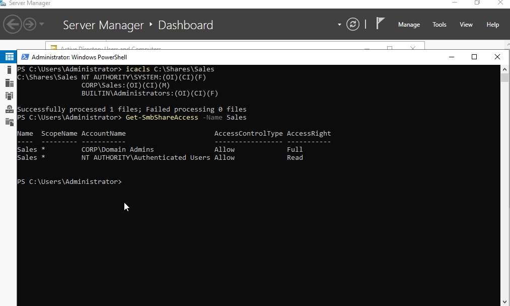
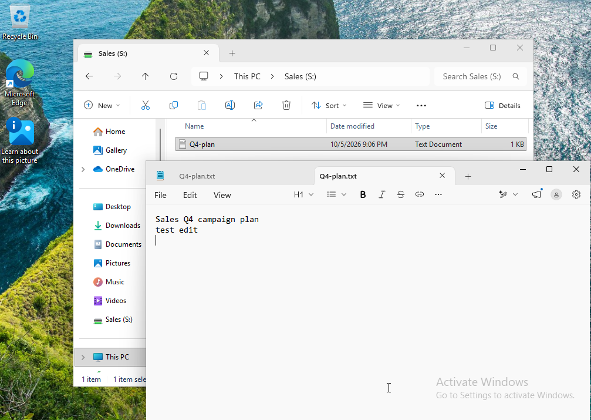

---

### Bonus: Clock drift between client and DC

**Issue found:** WIN01 and DC01 had both drifted about 25 minutes off, and WIN01 had the wrong time zone. Kerberos authentication fails when a client is more than 5 minutes off from the domain controller, so this could cause sign-in failures.

**Resolution:** I corrected the time zone, synced DC01 to an external time source, and confirmed WIN01 gets its time from DC01, which is how domain clients are supposed to sync.

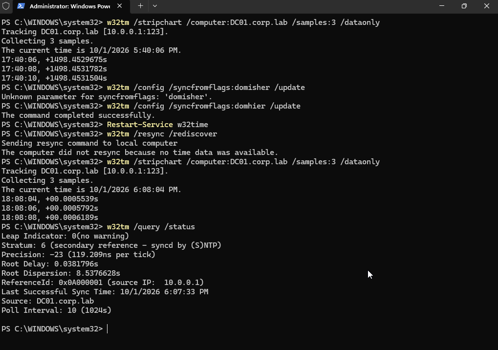

### Bonus: DC registering an unreachable IP in DNS

**Issue found:** `nslookup DC01.corp.lab` returned two addresses: 10.0.0.1 and a 192.168.68.x address from DC01's second network adapter, which connects to my home network for management. Lab clients can't reach that network, so any client that received that address would fail to reach the DC. That kind of issue shows up as intermittent sign-in and Group Policy problems.

**Resolution:** I disabled "Register this connection's addresses in DNS" on that adapter only and confirmed with `Get-DnsClient`. The extra record was removed, and nslookup from WIN01 now returns only 10.0.0.1.

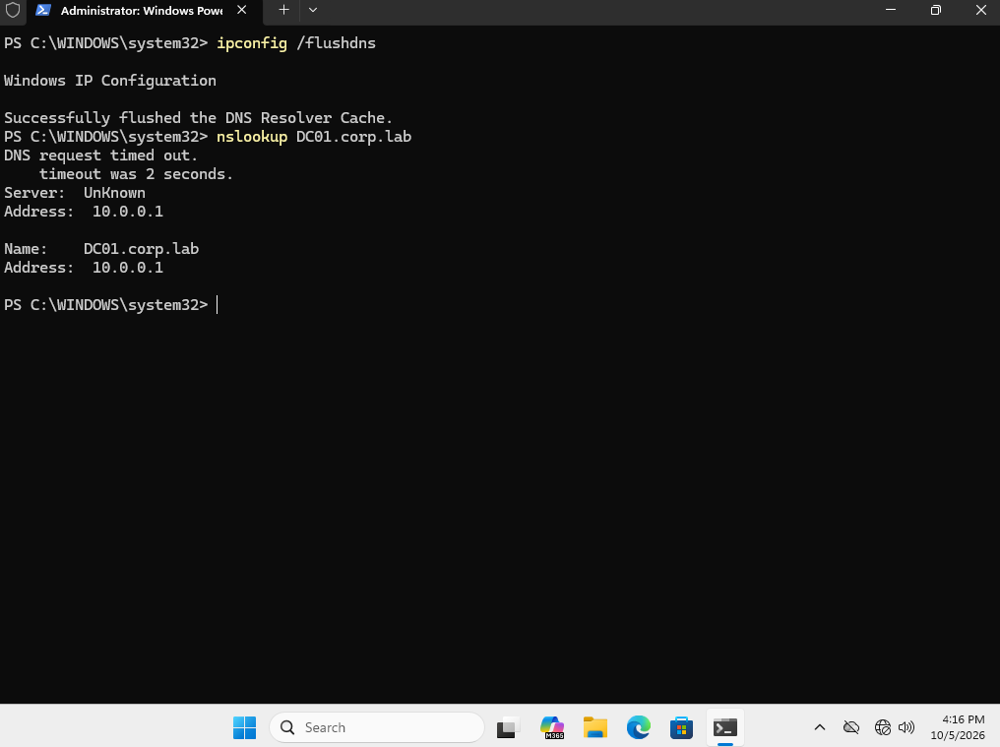

---

## Takeaways

Several tickets looked like one problem and turned out to be another. In Ticket #7 the GPO was fine and the account was just in the wrong place. In Ticket #8 the folder permissions were correct but the share permissions weren't. Checking with tools like gpresult, Get-ADUser, nslookup, and icacls before changing anything made the actual cause clear.

I also saw how much depends on signing out and back in. Group membership, drive maps, and share access are all picked up at sign-in, so "I fixed it but it still doesn't work" is often just an old session.
