# Home Lab: Simulated Enterprise Network and SIEM Detection

I built a small Windows domain, connected it to a Splunk SIEM, ran some common attacks against it, and wrote detections to catch them.

The point was to practice the loop a SOC analyst actually works in: generate real activity, get the logs flowing, understand what the events mean at the field level, and write alerts that fire on the right thing without creating a pile of noise. A lot of what I learned came out of the parts that broke, which I wrote up in the troubleshooting section near the bottom.

## Architecture

Four VirtualBox VMs on an isolated internal network (`intnet`). I kept the SIEM off the domain on purpose so it acts like a separate monitoring box, which means compromising the domain wouldn't automatically give an attacker the logs too.

| Host | Role | OS | IP |
|------|------|-----|-----|
| DC01 | Active Directory Domain Controller (`corp.lab`) | Windows Server 2022 | 10.0.0.1 |
| WIN01 | Domain-joined client | Windows 11 | 10.0.0.2 |
| LNX01 | Domain-joined client / attacker box | Ubuntu | 10.0.0.3 |
| SIEM01 | Splunk Enterprise SIEM (standalone) | Ubuntu Server | 10.0.0.4 |

DC01, WIN01, and LNX01 each run a Splunk Universal Forwarder that ships Windows Security, firewall, and PowerShell Operational logs to SIEM01 on port 9997.

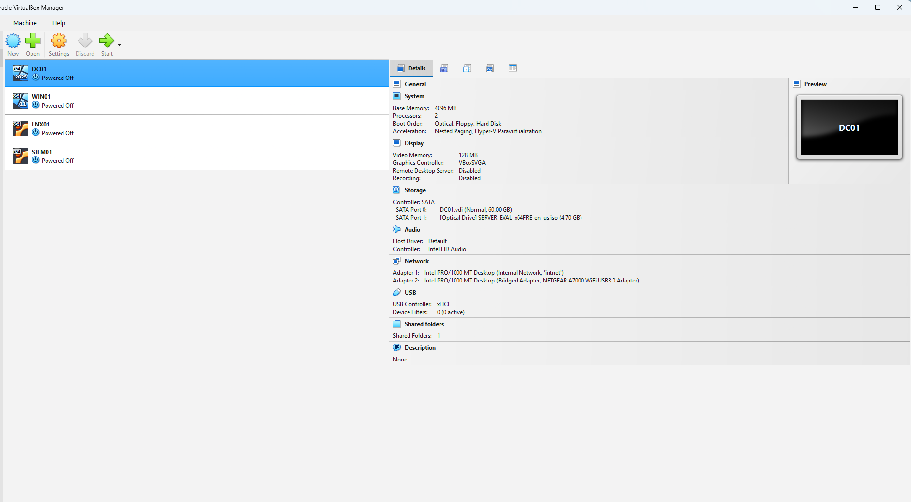

Tools used: VirtualBox, Windows Server 2022, Windows 11, Ubuntu, Splunk Enterprise with Universal Forwarders, NetExec, Nmap, Impacket (psexec.py), and Sysinternals PsExec.

## Attack Simulations and Detections

I simulated four techniques. Three of them have their own detection. For the fourth, network recon, I decided not to build an alert, and I explain why in that section.

### 1. SMB Brute Force

A password-guessing attack from LNX01 against the `svc-test` account on DC01 over SMB. The run also tripped the account lockout policy, which logs its own event and is often a better signal of a real brute force than the failed logons on their own.

MITRE ATT&CK: T1110.001, Brute Force: Password Guessing

```spl
index=main host=DC01 EventCode=4625 OR EventCode=4740
```

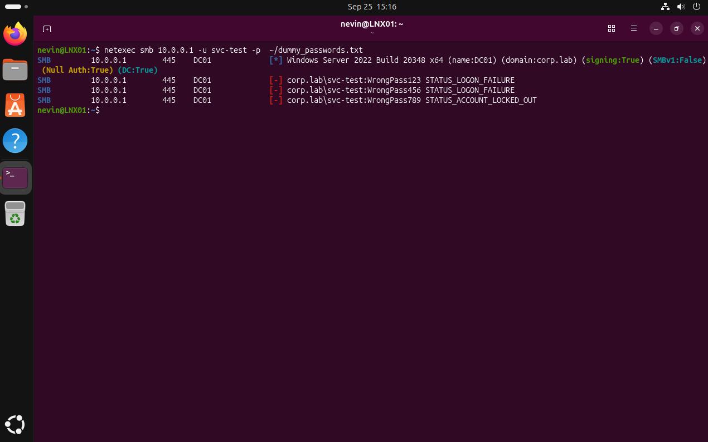

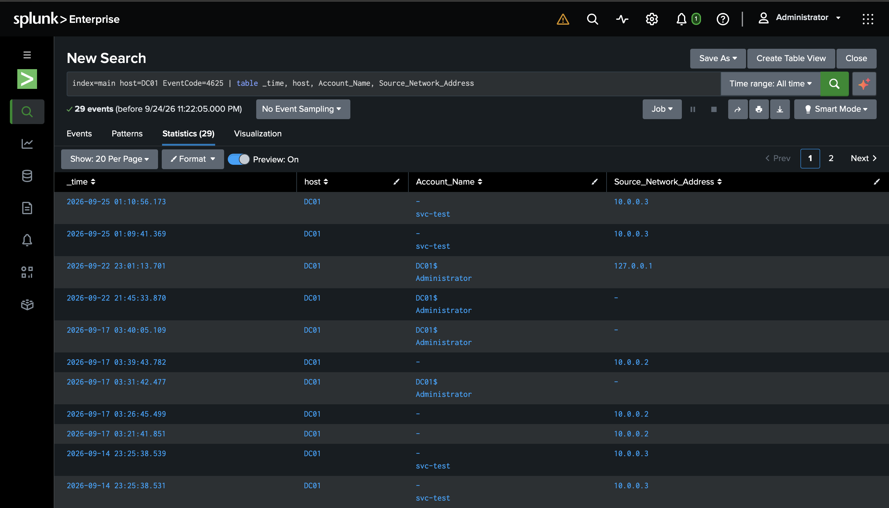

### 2. Network Reconnaissance

An Nmap `-A` sweep of the subnet from LNX01. DC01 came back fully fingerprinted as a Server 2022 domain controller, while WIN01 was almost completely filtered. That contrast shows the difference between a locked-down workstation firewall and a DC that has to expose AD services to work.

MITRE ATT&CK: T1046, Network Service Discovery

I did not build a detection for this on purpose. Scanning inside an internal domain is noisy and hard to separate from normal traffic without netflow tooling I don't have in the lab, so I put the detection effort into specific malicious actions instead and documented the decision rather than shipping an alert that would mostly false-positive.

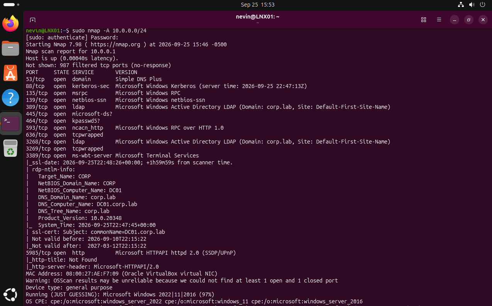

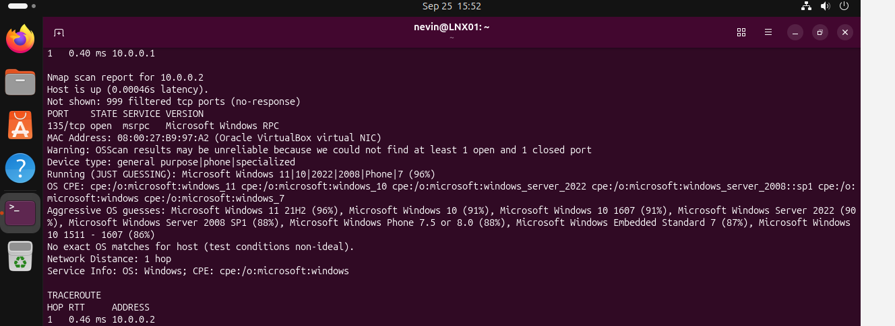

### 3. Encoded PowerShell Execution

I ran a Base64-encoded PowerShell command on WIN01, which is how an attacker hides a payload. Picking the right log source for this turned out to be a lesson on its own (troubleshooting note 4).

MITRE ATT&CK: T1059.001, PowerShell, and T1027, Obfuscated Files or Information

```spl
index=main host=WIN01 EventCode=4688 Message="*-EncodedCommand*"
```

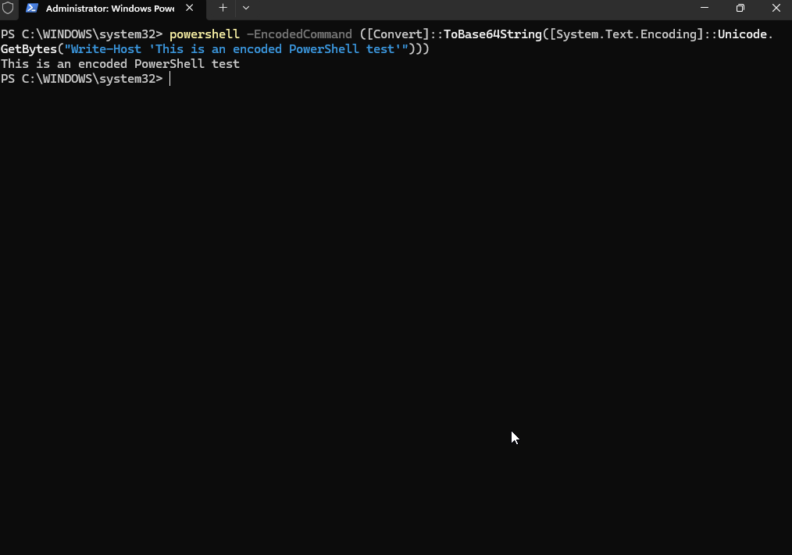

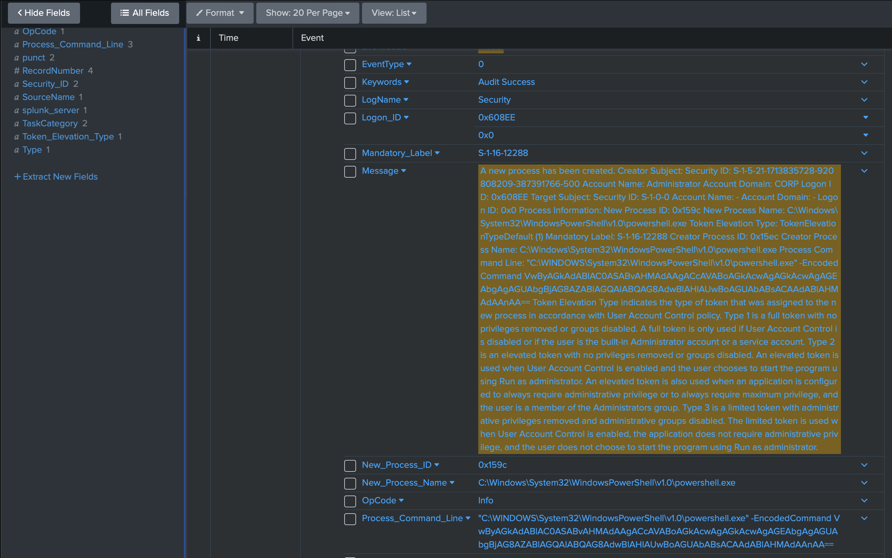

### 4. Lateral Movement (PsExec)

PsExec-style remote execution to move between hosts and get a remote shell. PsExec installs a temporary service on the target, which leaves two useful traces: a network logon (4624, Type 3) and a service-install event (7045).

MITRE ATT&CK: T1021.002, Remote Services: SMB/Windows Admin Shares, and T1569.002, System Services: Service Execution

```spl
index=main host=DC01 EventCode=4624 PSEXESVC
```

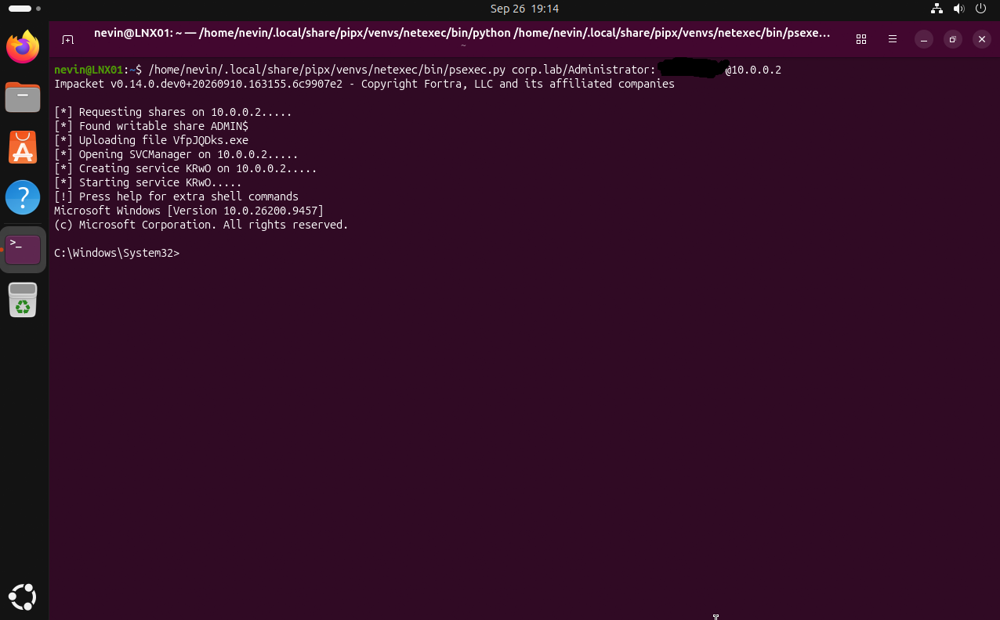

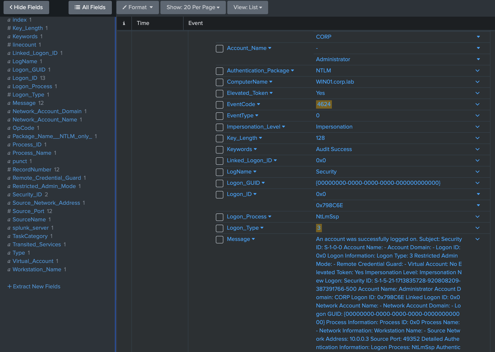

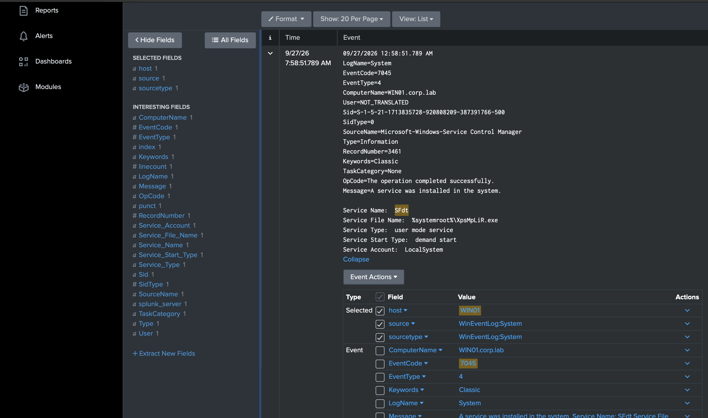

## Detection Dashboard

I built one dashboard, "Home Lab Security Overview," that pulls the techniques into a single view: authentication activity, PowerShell activity, firewall volume by host, lateral movement, and a running count of detections.

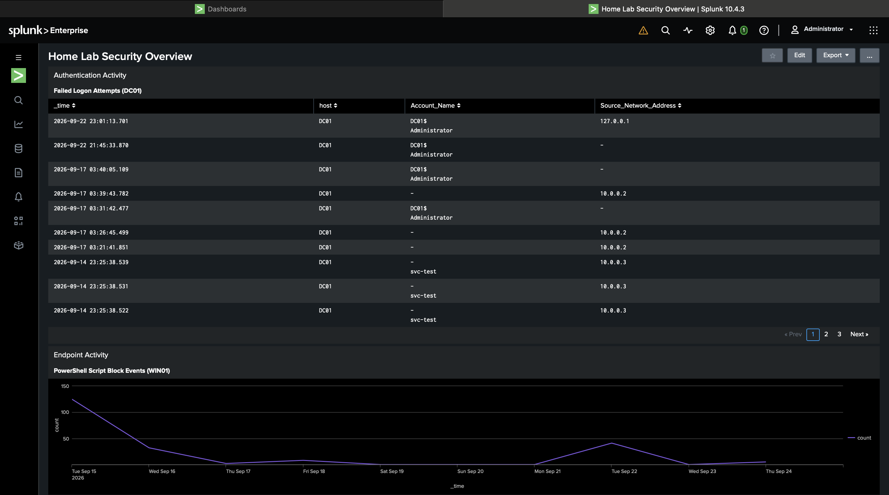

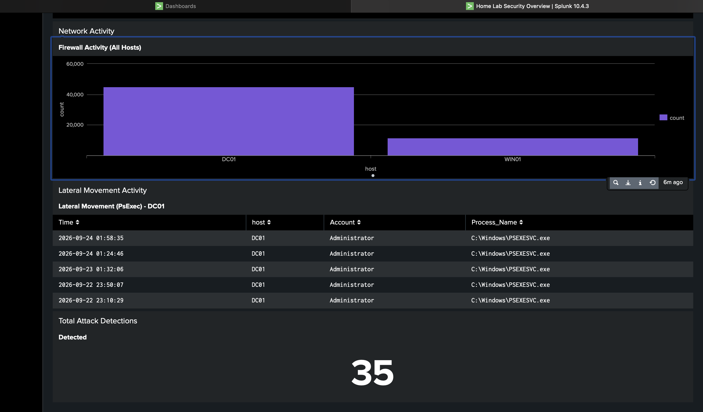

## Alerts

Three saved, scheduled alerts, each on its own cron interval and a rolling time window.

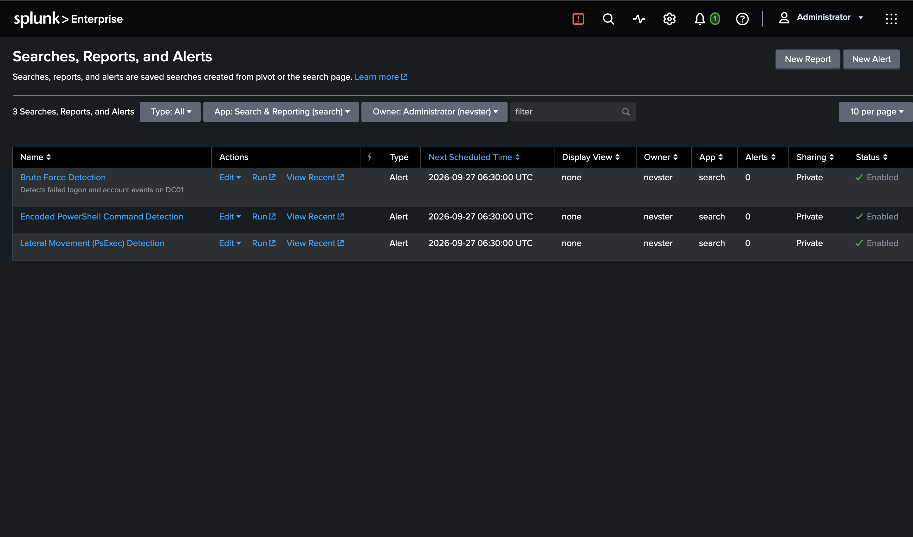

All three firing after a fresh round of simulated attacks:

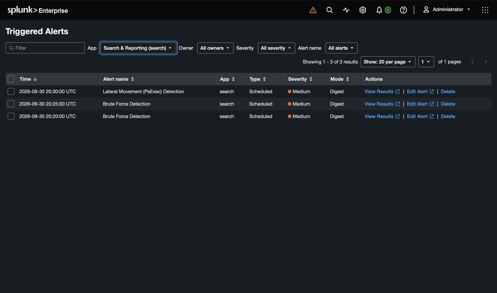

## Detection Coverage Summary

| Technique | MITRE ATT&CK ID | Detection |
|-----------|-----------------|-----------|
| SMB Brute Force | T1110.001 | 4625 / 4740 |
| Network Service Discovery | T1046 | None, scoped out on purpose |
| Encoded PowerShell | T1059.001 / T1027 | 4688 plus command line |
| Lateral Movement (PsExec) | T1021.002 / T1569.002 | 4624 Type 3 plus 7045 |

Three of the four techniques have a detection. The fourth was left un-alerted for the reason above.

## Troubleshooting and Lessons Learned

The build looked simple written down. In practice most of my time went into problems that didn't show any obvious error, where everything looked fine but nothing actually worked. These five taught me the most.

**1. A DNS failure that broke the whole domain.**
The domain kept misbehaving and it came down to DNS in three layers. A missing A record for the domain root on DC01 led to missing LDAP and Kerberos service records, which led to clients resolving through the wrong adapter's DNS. I worked it from the top down with `nslookup`, `ipconfig`, and the Windows service logs until name resolution was clean. The big takeaway was how much of Active Directory quietly falls apart when DNS isn't exactly right.

**2. Alerts that reported success but never fired.**
Every alert ran on schedule and reported success, but nothing ever showed up in Triggered Alerts. The cause was time. DC01's clock had drifted about two hours fast, so its events were being stamped outside the alerts' rolling search windows and never matched. What made it hard to find was that a wrong time zone was hiding the drift, because the wrong zone happened to cancel out the fast clock and show a roughly correct time on the taskbar. Setting the right zone exposed the real drift, and pointing the machine at a proper time source fixed it. The lesson stuck with me: an alert that runs clean with zero results can be hiding a time problem, not telling you there's nothing there.

**3. A log source that stopped reporting while the forwarder looked healthy.**
One log source went quiet, but the forwarder itself looked completely fine and its internal logs showed it alive and connected. The real problem was a corrupted config file that had broken the log monitor with no error anywhere. The lesson was that a forwarder being up does not mean the log pipeline is working. You have to check that the data is actually landing, not just that the agent is running.

**4. Script Block Logging doesn't log what I expected.**
My first idea for catching encoded PowerShell was Script Block Logging, event 4104. But 4104 only logs the decoded script content, not the original `-EncodedCommand` text the attacker typed. So I switched the detection to process-creation auditing, event 4688, with command-line logging turned on through Group Policy, which does capture the raw encoded command. The obvious log source isn't always the one that sees what the attacker actually did.

**5. A lateral movement detection gap hidden in a logon type.**
The PsExec detection wasn't catching sessions at first. Reading the Security events carefully, the logon was coming in as Logon Type 5, a service logon, because PsExec runs as a temporary service on the target. None of the group policy settings I had checked covered that case. Once I understood the logon type I fixed the right policy and confirmed the detection fired. This one taught me to read the actual fields on an event instead of assuming how an attack should look.

## Future Improvements

- Add Sysmon to WIN01 and DC01 for better process and network visibility
- Set a log retention and rotation policy on the Splunk index
- Add a fourth detection, likely privilege escalation
- Build a scheduled health check on the log pipeline so a dead forwarder shows up on its own instead of going quiet

---

Personal project, built and documented on my own while learning practical SOC and detection work.
